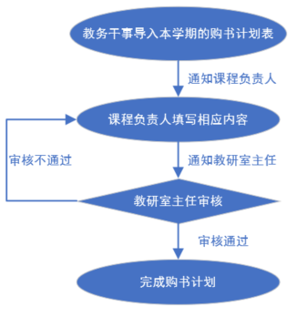
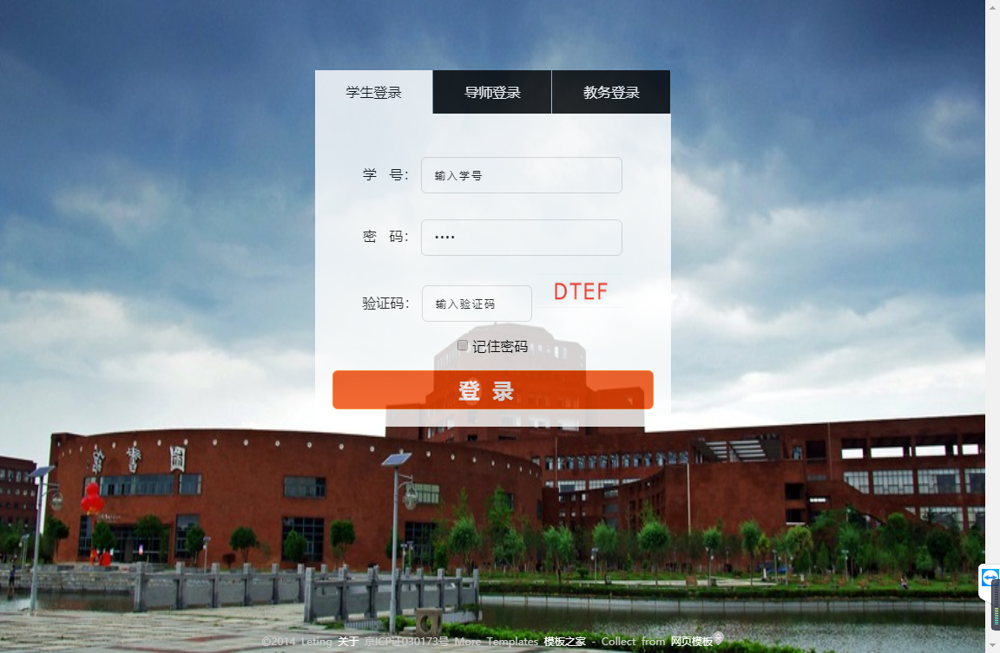
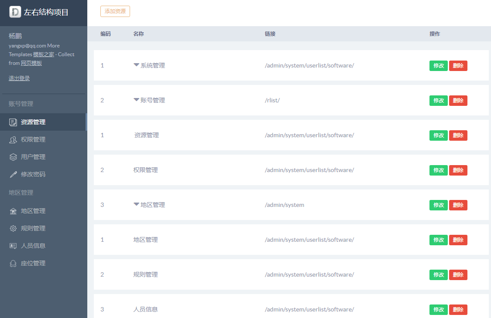
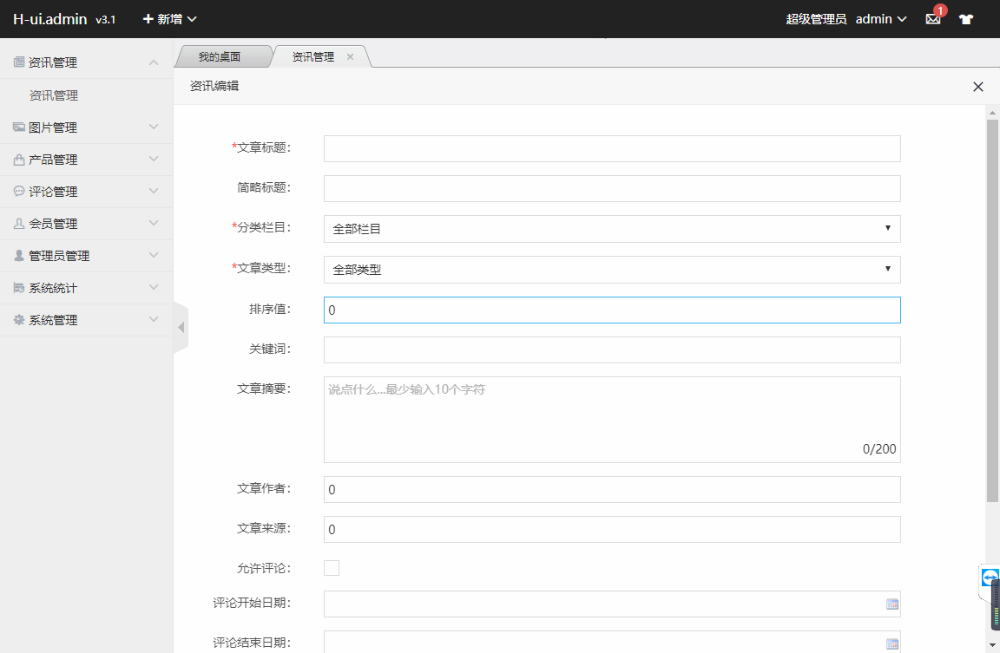
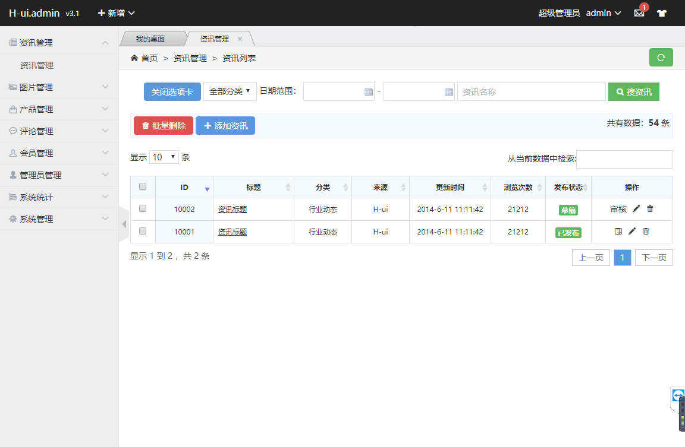

# 购书审批系统
## 项目介绍
### 背景
> 学校每学期都会开设各种各样的课程，每门课程都会需要相对应的教材。然而教材的选取需要经过学校审批，按照目前情况，教材审批的工作都是由课程负责人填写审批表，然后提交，
> 最后等待教研室主任审批。因此课程负责人只能被动等待结果，不知道审批进度、审批出现的问题等情况，同时，每年都有许多重复的课程，但是每年都需要进行同样的工作，
> 实际上，重复的课程可以使用之前的审批过程，但是，上一次填写的审批表若丢失，又需要重新写，制造了许多不必要的麻烦。除此之外，如果课程是去年开的，
> 但是今年课程负责人换了，新课程负责人无法充分利用以往的资源，带来了许多不便。基于此类问题，设计人员开发了本系统。

### 逻辑分析
> 暂定需要四个角色：1.管理员 2.教务干事 3.课程负责人 4.教研室主任  
>
> 各角色功能：  
>   管理员：用于管理本系统  
>   教务干事：需要导入"[附件1，计划表](./file/附件1：北京理工大学珠海学院xxxx-xxx学年第x学期教材征订计划表.xls)"中的内容  
>   课程负责人：需要填写各自负责的"附件1，计划表"中的其他内容，如果上学年有教材已经录入，希望可以有是否采用原来的。采用的话，就不输入，不采用才重新输入。  
>   教研室主任：负责审核、输入各自教研室的负责老师填写的计划内容，有审核标记。审核后，导出“附件1，审批表”，还需要导出“[附件4，统计表](./file/附件4：xxxx-xxxx学年第x学期境外原版教材检查情况统计表.xlsx)”  
> 
> 具体过程如下图所示：  
>   
> 

### 前端效果图
**1.登录画面：**  
   

**2.登录后的首页：**    
    

**3.点击“成绩录入”后的页面，将出现以前所有的成绩录入情况。以前的只能看，本学期的可以录入：**   
   

**4.点击最右列的“进入”，可以进入所有以前学期的成绩录入情况，可以看成绩，但是不做能修改，比如上学期的，只能看“查看”和“审核记录”：**   
   

**5.本学期的：因为我已经都登录了，现在是录入完毕，就是“是”。可以“查看”和“审核记录”，可以有“审核状态”一栏**   
   

**6.如果没有录入，可以点击录入，则可具体录入。**   
   

***tips:***   
> 1. 教师的画面大致如上。可以参考这些，设计管理者、教研室主任和教务干事的画面。  
> 2. 上述为效果图，并非真正的设计图，所以仅仅是诸如此类。  

### 技术要求
> 前端：html、css、JavaScript、ajax  
> 后端：java、ajax、Spring、SpringMVC、MyBatis、Maven、通用Mapper、MySQL  

## 环境搭建
### 软件安装
> IDEA、Maven、SQLyog

### 本地数据库搭建
#### 建库
````
CREATE DATABASE goushushenpixitong;
````

#### 建表
````
/*1.学院*/
CREATE TABLE `institute` (
	`id` VARCHAR(100),
	`name` VARCHAR(255) NOT NULL,
	`remarks` VARCHAR(255),
	PRIMARY KEY ( `id` )
)ENGINE=INNODB DEFAULT CHARSET=utf8;

/*2.专业*/
CREATE TABLE `major` (
	`id` VARCHAR(100),
	`name` VARCHAR(255) NOT NULL,
	`institute_id` VARCHAR(100),
	`remarks` VARCHAR(255),
	PRIMARY KEY ( `id` ),
	CONSTRAINT `fk_major_institute` FOREIGN KEY(`institute_id`) REFERENCES `institute` (`id`)
)ENGINE=INNODB DEFAULT CHARSET=utf8;

/*3.人员*/
CREATE TABLE `staff` (
	`id` VARCHAR(100),
	`name` VARCHAR(150),
	`pwd` VARCHAR(255) DEFAULT "123456",
	`major_id` VARCHAR(100) NOT NULL,
	`institute_id` VARCHAR(100) NOT NULL,
	`tel` VARCHAR(50),
	`remarks` VARCHAR(255),
	PRIMARY KEY ( `id` ),
	CONSTRAINT `fk_staff_major` FOREIGN KEY(`major_id`) REFERENCES `major` (`id`),
	CONSTRAINT `fk_staff_institute` FOREIGN KEY(`institute_id`) REFERENCES `institute` (`id`)
)ENGINE=INNODB DEFAULT CHARSET=utf8;

/*4.角色*/
CREATE TABLE `role` (
	`id` VARCHAR(100),
	`type` INT NOT NULL,
	`remarks` VARCHAR(255),
	CONSTRAINT `fk_role_staff` FOREIGN KEY(`id`) REFERENCES `staff` (`id`)
)ENGINE=INNODB DEFAULT CHARSET=utf8;

/*5.学期*/
CREATE TABLE `term`(
    `id` INT UNSIGNED AUTO_INCREMENT,
    `name` VARCHAR(255) NOT NULL,
    `remarks` VARCHAR(255),
    PRIMARY KEY ( `id` )
)ENGINE=INNODB DEFAULT CHARSET=utf8;

/*6.课程*/
CREATE TABLE `course`(
    `id` VARCHAR(100),
    `term_id` INT UNSIGNED NOT NULL,
    `name` VARCHAR(255) NOT NULL,
    `period` INT UNSIGNED,
    `credit` INT UNSIGNED,
    `usable_range` VARCHAR(255) NOT NULL,
    `student_num` INT UNSIGNED NOT NULL,
    `teacher_num` INT UNSIGNED NOT NULL,
    `principal_id` VARCHAR(100),
    `remarks` VARCHAR(255),
    PRIMARY KEY ( `id`,`term_id`),
    CONSTRAINT `fk_course_staff` FOREIGN KEY(`principal_id`) REFERENCES `staff` (`id`),
    CONSTRAINT `fk_course_term` FOREIGN KEY(`term_id`) REFERENCES `term` (`id`)
)ENGINE=INNODB DEFAULT CHARSET=utf8;

/*7.教材等级*/
CREATE TABLE `level`(
    `id` INT UNSIGNED NOT NULL AUTO_INCREMENT,
    `name` VARCHAR(255) NOT NULL,
    `remarks` VARCHAR(255),
    PRIMARY KEY ( `id`)
)ENGINE=INNODB DEFAULT CHARSET=utf8;

/*8.书*/
CREATE TABLE `book`(
    `id` VARCHAR(150) NOT NULL,
    `name` VARCHAR(200) NOT NULL,
    `author` VARCHAR(255) NOT NULL,
    `publisher` VARCHAR(255) NOT NULL,
    `publish_date` VARCHAR(60) NOT NULL,
    `edition` INT UNSIGNED,
    `nation` VARCHAR(255),
    `type` INT UNSIGNED,
    `purpose` INT UNSIGNED,
    `level_id` INT UNSIGNED NOT NULL,
    `price` INT NOT NULL,
    `renew` bit ,
    `remarks` VARCHAR(255),
    PRIMARY KEY ( `id`),
    CONSTRAINT `fk_book_level` FOREIGN KEY(`level_id`) REFERENCES `level` (`id`)
)ENGINE=INNODB DEFAULT CHARSET=utf8;

/*9.课程用书*/
CREATE TABLE `subject`(
    `id` INT UNSIGNED AUTO_INCREMENT,
    `course_id` VARCHAR(100) NOT NULL ,
    `term_id` INT UNSIGNED NOT NULL,
    `book_id` VARCHAR(150) NOT NULL,
    `remarks` VARCHAR(255),
    PRIMARY KEY ( `id`),
    CONSTRAINT `fk_subject_term` FOREIGN KEY(`term_id`) REFERENCES `term` (`id`),
    CONSTRAINT `fk_subject_book` FOREIGN KEY(`book_id`) REFERENCES `book` (`id`),
    CONSTRAINT `fk_subject_course` FOREIGN KEY(`course_id`) REFERENCES `course` (`id`)
)ENGINE=INNODB DEFAULT CHARSET=utf8;

/*10.审批表*/
CREATE TABLE `approval`(
    `subject_id` INT UNSIGNED,
    `option_lab` VARCHAR(250) NOT NULL,
    `option_unit` VARCHAR(250) NOT NULL,
    `option_dean` VARCHAR(250) NOT NULL,
    CONSTRAINT `fk_approval_subject` FOREIGN KEY(`subject_id`) REFERENCES `subject` (`id`)
)ENGINE=INNODB DEFAULT CHARSET=utf8;

/*11.教研处*/
CREATE TABLE `laboratory`(
    `id` INT UNSIGNED AUTO_INCREMENT,
    `content` VARCHAR(255) NOT NULL,
    `remarks` VARCHAR(255),
    PRIMARY KEY ( `id`)
)ENGINE=INNODB DEFAULT CHARSET=utf8;

/*12.开课教学单位*/
CREATE TABLE `teaching_unit`(
    `id` INT UNSIGNED AUTO_INCREMENT,
    `content` VARCHAR(255) NOT NULL,
    `remarks` VARCHAR(255),
    PRIMARY KEY ( `id`)
)ENGINE=INNODB DEFAULT CHARSET=utf8;

/*13.教务处*/
CREATE TABLE `dean_office`(
    `id` INT UNSIGNED AUTO_INCREMENT,
    `content` VARCHAR(255) NOT NULL,
    `remarks` VARCHAR(255),
    PRIMARY KEY ( `id`)
)ENGINE=INNODB DEFAULT CHARSET=utf8;
````

#### 表结构
  

### 运行项目
若访问接口``http://localhost:8624/goushushenpixitong/test``出现以下json对象，则证明环境搭建完成：  
````
{
    "code": 200,
    "success": true,
    "message": "请求成功",
    "data": "mdzz"
}
````

***tips:***  
> 1. 表结构若看不清，可以下载visio，打开[数据库表设计图](./file/数据库表设计.vsdx)文件 
> 
> 2. 数据库默认连接的是本人在学校中部署的云数据库,ip为``10.0.78.26``，
> 如果你是在学校里，可以使用校园网访问到该云数据库，该云数据库用户名为``root``
> 密码为``123456``,请使用者不要更改其中的表结构以及删除他人插入的数据，也请不要恶意破坏。
> 
> 3. 如果你对本项目有兴趣，可以联系我  
> 微信：``duganlx``  
> QQ：``840797783``  
> EMAIL：``840797783@qq.com``


### API说明
> controller文件夹存放的所有文件都是接口，具体使用请看下面例子：  
> 下面代码节选controller中的BookController，我将以其中一个接口进行说明：  
> 1. 首先运行该项目，保证项目环境正常
> 2. 比如我们要测试*查询所有书本记录*这个接口
> 3. 我们访问的url为：``http://localhost:8624/goushushenpixitong/book/list?currentPage=1&pageSize=3``
> ，其中 ``http://localhost:8624`` 是在本地（localhost）运行项目，在8624端口，
> ``goushushenpixitong/`` 是项目的根路径，
> ``book/list`` 对应下面的①和②，
> 使用 ``@param`` 标记代表需要传的参数
````
@RestController
@RequestMapping("/book") //①
public class BookController {

    @Autowired
    private BookService bookService;

    /**
     * 查询所有书本记录
     *
     * @param currentPage 当前页数
     * @param pageSize    每页显示的总记录数
     * @return
     */
    @GetMapping("/list") //②
    public CommonResult list(@RequestParam("currentPage") Integer currentPage, @RequestParam("pageSize") Integer pageSize) {
        return CommonResult.success(bookService.findBooksByPage(currentPage, pageSize));
    }

````